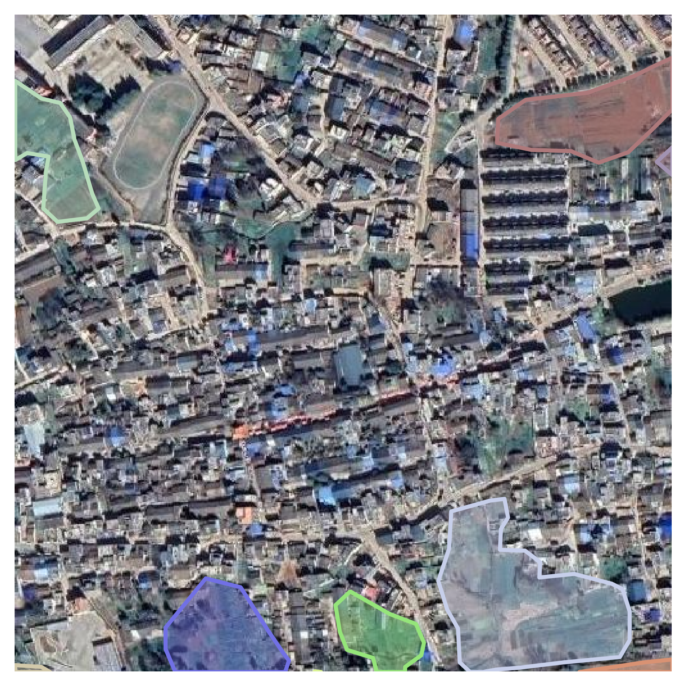

# georaster2coco

## Tutorial
This repo. has two key scripts to convert or visualize. If you need customize your
own georaster dataset to [MS-COCO format](http://cocodataset.org/#home).

## Usage

### `class geo2cocoConvertor`
The `class geo2cocoConvertor` should be initialized firstly by following parameters:
- `dst_root`: the dataset root, in which the internal structure is:  
$\qquad$    |---root  
$\qquad$    &emsp;&emsp;|---images 
$\qquad$    &emsp;&emsp;| $\qquad$   &emsp;&emsp;|—00001.png 
$\qquad$    &emsp;&emsp;| $\qquad$   &emsp;&emsp;|—00002.png 
$\qquad$    &emsp;&emsp;| $\qquad$   &emsp;&emsp;|— ... 
$\qquad$    &emsp;&emsp;|—annotations.json 

- `clip_size`: to crop the raster image and relating vector to patch. Defaual is `None` which means DO NOT clip.

- `clip_stride`: Available if `clip_size` is not `None`. Controls the shifting stride of the window to clip.

- `suffix`: The suffix of the output raster patch, defaul as `'jpg'`

- `prefix`: The prefix of the ouput raster files, defual as `''`

### `coco_utils`

To visualize the dataset, and the demo is listed:
<table>
    <tr>
        <td >

</td>
        <td >

</td>
        <td >

</td>
        <td >

</td>
        <td >

</td>
    </tr>
    <tr>
        <td >

</td>
        <td >

 </td>
        <td >

 </td>
        <td >

 </td>
        <td >

 </td>
    </tr>
    <tr>
        <td >

</td>
        <td >

 </td>
        <td >

 </td>
        <td >

 </td>
        <td >

 </td>
    </tr>
</table>

# TODO
Enrich.